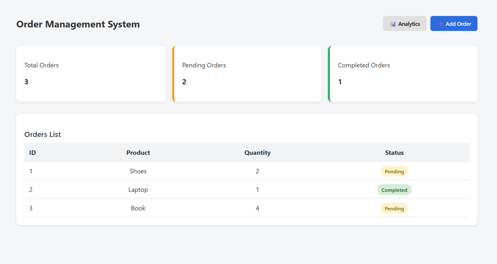
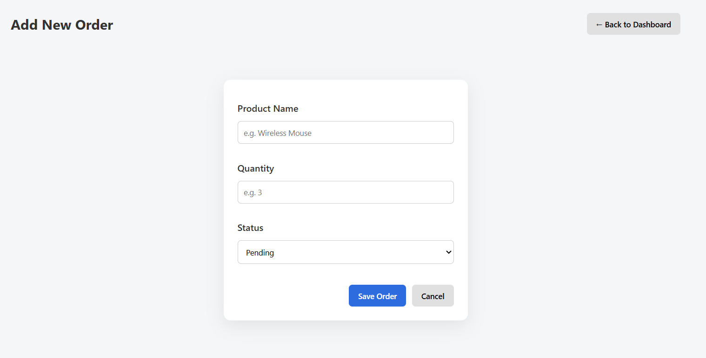
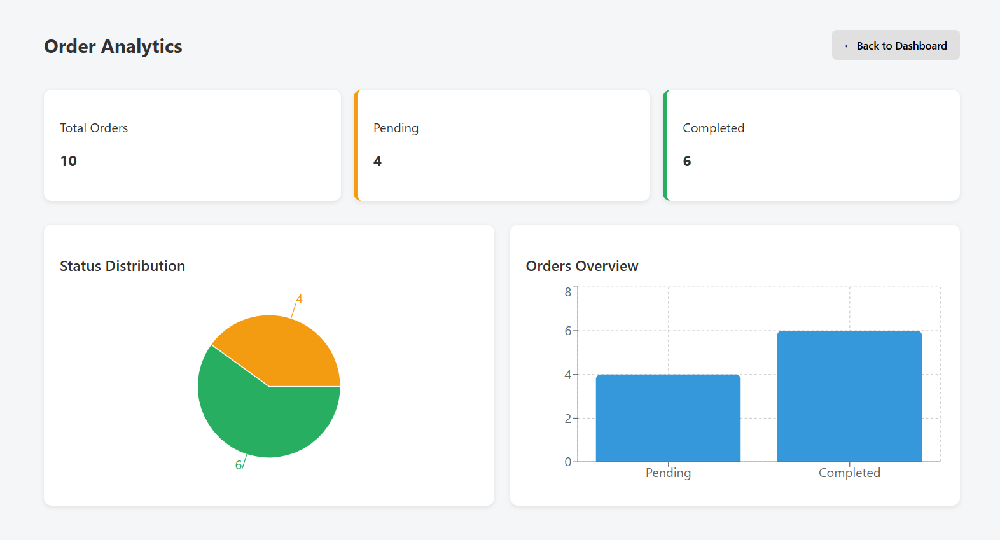

# Order Management System 

A clean and responsive Order Management System built using **React**.

##  Features
- Dashboard with Total, Pending, and Completed orders
- Order listing with status badges
- Separate pages for:
  - Dashboard
  - Add Order
  - Analytics
- Analytics visualization
- Clean and minimal UI

##  Screenshots

### Dashboard


### Add Order Page


### Analytics Page


##  Tech Stack
- React
- React Router
- CSS
- Recharts

##  How to Run Locally
```bash
npm install
npm start
